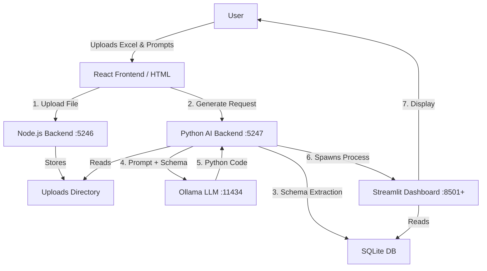

# AI Dashboard Generator - Workflow & Features

## 1. Project Overview

The **Self Service Dashboard AI** is a comprehensive platform that democratizes data analysis by allowing users to generate professional, interactive dashboards using natural language. It leverages **Ollama (LLM)** to understand user intents and **Streamlit** to dynamically generate and host data visualization applications.

This system is designed to handle complex data schemas (especially in manufacturing and logistics) and provides a seamless "Text-to-Dashboard" experience.

## 2. Architecture Overview

The system follows a microservices architecture with four main components:

1.  **Frontend (React & HTML)**: The user interface for uploading data and entering prompts.
2.  **Simple Backend (Node.js)**: Handles file uploads, initial data processing, and serves as the data bridge.
3.  **AI Backend (Python/Flask)**: The brain of the operation. It manages the LLM integration, converts data, generates code, and orchestrates dashboard processes.
4.  **Backend (.NET Web API)**: *Optional/Legacy*. Provides endpoints for Graphic Walker integration and ODBC database connections.

### System Diagram

## 3. Detailed Workflow

### Step 1: Data Ingestion
*   **Action**: User uploads an Excel file (`.xlsx`) via the UI.
*   **Process**:
    *   The file is sent to the **Simple Backend** (`/Dataset/Upload`).
    *   The backend saves the file to the `uploads/` directory.
    *   Basic field analysis (identifying dimensions vs. measures) is performed.

### Step 2: Intent Analysis & Data Preparation
*   **Action**: User enters a prompt (e.g., "Show me OEE by lane for the night shift").
*   **Process**:
    *   The **AI Backend** receives the prompt and the file path.
    *   It converts the Excel data into a optimized **SQLite** database (`terminal_data.db`).
    *   *Normalization*: Column names are sanitized, dates are parsed, and derived metrics (e.g., `Throughput_Units_Hour`) are calculated automatically.
    *   *Intent Classification*: The system analyzes keywords to classify the request (e.g., "Manufacturing", "Financial", "HR").

### Step 3: Retrieval-Augmented Generation (RAG)
*   **Concept**: To generate correct code, the AI needs to know the *exact* database structure, not just the user's wish.
*   **Process**:
    *   The backend extracts the **Schema** (table names, column names, data types) and **Sample Data** (first 5 rows) from the SQLite DB.
    *   It constructs a sophisticated prompt for **Ollama** that includes:
        *   The User's Request.
        *   The Selected Dashboard Type (and its specific best practices/requirements).
        *   The **Strict Data Context** (Schema + Samples).
    *   *Goal*: This ensures the generated SQL queries and Pandas operations use real column names (e.g., `GrossQuantity` instead of guessing `quantity`).

### Step 4: Code Generation & Execution
*   **Action**: Ollama returns Python code using the `streamlit` and `plotly` libraries.
*   **Process**:
    *   The AI Backend saves this code to a file in `generated-dashboards/`.
    *   It launches a **subprocess** to run this file (`streamlit run ...`).
    *   It assigns a unique port (e.g., 8501, 8502) to this new dashboard.

### Step 5: Delivery
*   **Action**: The system returns the URL of the running dashboard.
*   **Result**: The Frontend displays the interactive dashboard in an iframe or new tab.

## 4. Key Technical Features

### 🧠 Natural Language Understanding
*   **Context-Aware**: Understands domain-specific terms like "OEE", "Throughput", and "Takt Time" based on the classified dashboard type.
*   **Field Mapping**: Intelligent mapping of user terms (e.g., "sales") to actual database columns (e.g., `GrossQuantity`).

### 🔄 Dynamic Code Generation
*   **Meta-Programming**: The system writes software at runtime. It doesn't just fill templates; it generates executable Python logic tailored to the data.
*   **Self-Correction**: (Implemented in logic) The prompt instructions explicitly forbid sample data generation when real data is available.

### 📊 Interactive Visualization
*   **Plotly Integration**: Generates interactive charts (zoom, pan, hover).
*   **Streamlit**: Provides a robust, responsive web framework for the dashboards without manual HTML/CSS coding.

### 🛡️ Data Handling
*   **Local Processing**: All data stays within the environment (local LLM, local SQLite). No data is sent to external cloud APIs.
*   **Normalization**: Automatic handling of date formats and numeric conversions prevents common data errors.

## 5. Current Implementation Notes (For Interviewer)

*   **Demo vs. Production**:
    *   The `DashboardGenerator` class contains the full, sophisticated logic described above.
    *   *Note*: In the current `app.py` configuration, there may be a "Demo Mode" bypass active (returning a fixed URL for speed during demonstrations). To see the full AI generation in action, the `generate_dashboard` route in `app.py` calls `generator.generate_dashboard_code`.
*   **Scalability**: The system uses separate processes for each dashboard, ensuring one heavy query doesn't crash the main server.
*   **Polyglot Stack**: Demonstrates ability to integrate Node.js (fast I/O), Python (Data/AI), and .NET (Legacy/Enterprise integration) seamlessly.
